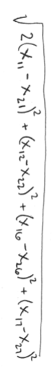

### 1 School Quality

When seeking a dream school, it is important to me that the school cultivates student growth and has a diverse student body, and that the school has adequate resources to serve my student. I would select $X_1$, $X_2$, $X_6$, and $X_7$ to include in my matrix. Because my student wants to study statistics when she finishes high school, growth in math ($X_1$) will be weighted double. See page 2 for the equation.



```{r}
```

### 2 Cluster analysis: 2012 WA election data

```{r echo=TRUE}
data<- read.csv("wa_election.csv")
```

## 2A: 
Create a distance matrix using dist function which automatically calculates a
distance matrix for us.

```{r}
distraw <- dist(data)
# distraw

```


## 2B
Based on the tree, how many clusters do you think are appropriate?

\textbf{Based on the dendrogram below, I would say that 3 clusters are appropriate, because as Bartholomew et al. noted in the text, what we should be looking for is "a group of branches to come together at around the same point and then not to be involved in further amalgamations for some distance". This pattern is evident below at the 3-cluster level, where branches join together at frequent intervals from distance 0 to distance 40, and then there is no further grouping for another ~30 units of distance at around distance 70.}
```{r}
avclust <- hclust(distraw, method="average")
plot(avclust)
```


## 2C

Based on the average values for each cluster, how would you describe the differences among clusters? 

\textbf{I notice a pattern in which Cluster 3 is more liberal, and people in these regions are most likely to vote for democrats Jay Inslee and Barack Obama, followed by Cluster 2 which is split in its politics about 50/50 for both races, with Cluster 1 most conservative, likely to vote for Republicans Mitt Romney and Rob McKenna.}


```{r}
county.clusters <- cutree(tree = avclust, 3)
avg.value <- aggregate(data[,-1], FUN = mean, by = list(county.clusters))

```

## 2D

When organized by geography, what do you notice about the clusters?

\textbf{It appears that Seattle/King County and the San Juan Islands, as well as Jefferson County, are grouped together as most liberal, while the center of the state is most conservative. The remaining coastal portion of the state, and counties to the east with large universities, tend to be split.}

```{r}
library(maps)
clusters.for.map <- c(county.clusters[1:26],
rep(county.clusters[27],2),
rep(county.clusters[28],3),
county.clusters[29:39])
colors <- c("salmon", "plum", "skyblue")
map(database = "county", region = "washington",fill = T, col = colors[clusters.for.map])
map.text(database = "county", region = "washington", add = T, font =2, cex= .6)
legend(x = "bottomright", col = colors, pch = 20,
legend = paste(c(1:3)), title = "Cluster", ncol = 3, cex = .8, xpd = T, inset = c(0, -.05))
```

## 2D

Would you obtain the same clustering with "single" linkage as with the ”average” linkage algorithm?

\textbf{No; using this method, we get only 2 clusters; one cluster contains 3 counties, while all the rest are grouped together. In the map below, we see that the counties which were counted before as a 50/50 split politically are now all grouped with the conservative counties.}

```{r}

singclust <- hclust(distraw, method="single")
plot(singclust)

```
```{r}

county.clusters <- cutree(tree = singclust, 2)
avg.value <- aggregate(data[,-1], FUN = mean, by = list(county.clusters))
clusters.for.map <- c(county.clusters[1:26],
rep(county.clusters[27],2),
rep(county.clusters[28],3),
county.clusters[29:39])
colors <- c("salmon", "plum")
map(database = "county", region = "washington",fill = T, col = colors[clusters.for.map])
map.text(database = "county", region = "washington", add = T, font =2, cex= .6)
legend(x = "bottomright", col = colors, pch = 20,
legend = paste(c(1:2)), title = "Cluster", ncol = 2, cex = .8, xpd = T, inset = c(0, -.05))
```

### 3 Euclidian Distance

## 3A

Write an equation for the Euclidean distance between the two observations in terms of $x_i$ and $y_i$, i = 1, 2, 3, 4, 5.

\textbf{Note: I didn't know how to express matches or logical statements mathmatically, so I did my best to get the right idea in there! See following 2 pages for equations.}


## 3A

Write an equation for the Euclidean distance between the two observations in terms of matches and mismatches.


```{r}

```


